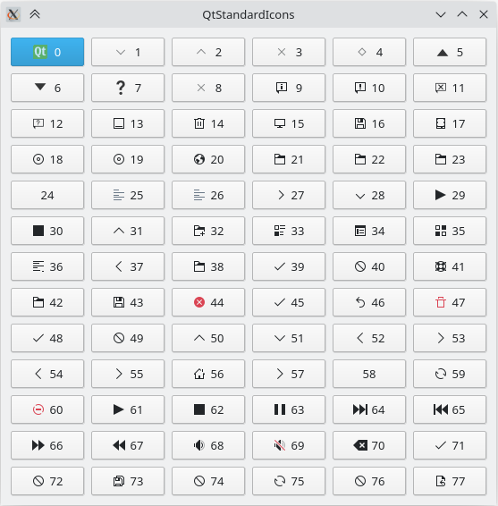

# Qt Standard Icons

 There are 78 standard icons in Qt5.15.2, which can be use directly on your own UI. This demo shows how to use them and how they looks like.

Click on a button and its enum name will be shown in the terminal.

You can try other standard styles by passing `-style xxx` command line argument to the exe.

